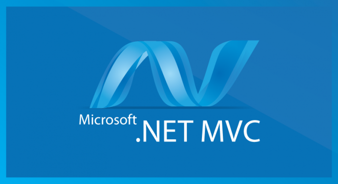
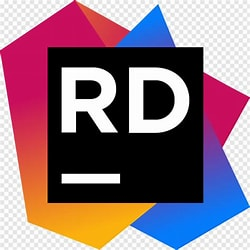
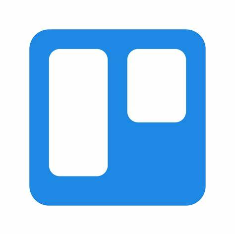

<h1 align="center">
  
</h1>

<h5 align="center">
  <code><a href="https://www.linkedin.com/in/nguyen-cao-nam-vu/" title="LinkedIn Profile"> LinkedIn</a></code>
  <code><a href="https://leetcode.com/u/NoNameNo1F/" title="Leetcode Profile"> LeetCode</a></code>
</h5>
 

  Hello, I'm Vu Nguyen (Cao Nam), a Senior Undergraduate at VNU-HCMUS majoring in Networking and Cybersecurity, as well as a .NET Backend Engineer from Vietnam.
   
   
  🔬 I am currently expanding my knowledge in Modular Monolith and Microservice architectures.
   
  🎓 I am studying at the University of Science, VNU-HCM, under the Department of Information Technology (Senior Undergraduate).
   
  📚 I’m currently focused on learning how to develop Modular Monolith web applications using .NET Core.
   
  💬 Feel free to ask me anything via <a href="https://github.com/NoNameNo1F/NoNameNo1F/issues" title="Issues">GitHub Issues</a>.
   
  📫 You can reach me at <a href="mailto: vunguyencaonam@gmail.com">vunguyencaonam@gmail.com (for work)</a> or <a href="mailto: nonameno1f@gmail.com">nonameno1f@gmail.com (for personal)</a>.

---

This version offers a more structured, professional tone while keeping the original information intact.

<h2 align="center">🔥 Languages & Frameworks & Tools & Abilities 🔥</h2>
 

  <code></code>
  <code></code>
  <code></code>
  <code></code>
  <code></code>
  <code></code>
  <code></code>
  <code></code>
  <code></code>
  <code></code>
  <code></code>
  <code></code>
  <code></code>
  <code></code>
  <code></code>
  <code></code>
  <code></code>
  <code></code>
  <code></code>
  <code></code>
  <code></code>
  <code></code>
  <code></code>
  <code></code>

<h2 align="center">⚡ Stats ⚡</h2>
 

  

    
    <a href="https://github.com/nonameno1f/github-readme-stats" title="Go to Source">
      

  

           
  

    
  

   
  
  

<h2 align="center">👨‍💻 Repositories 👨‍💻</h2>
 

  

      

      

  
  

  

<!--
**zumrudu-anka/zumrudu-anka** is a ✨ _special_ ✨ repository because its `README.md` (this file) appears on your GitHub profile.

Here are some ideas to get you started:

- 🔭 I’m currently working on ...
- 🌱 I’m currently learning ...
- 👯 I’m looking to collaborate on ...
- 🤔 I’m looking for help with ...
- 💬 Ask me about ...
- 📫 How to reach me: ...
- 😄 Pronouns: ...
- ⚡ Fun fact: ...

Notes: If you want use this readme, firstly star it please. If you can't align your repositories like this, please change your repository desription to shorter than now. Maybe 4 or 5 word will be good.

-->
